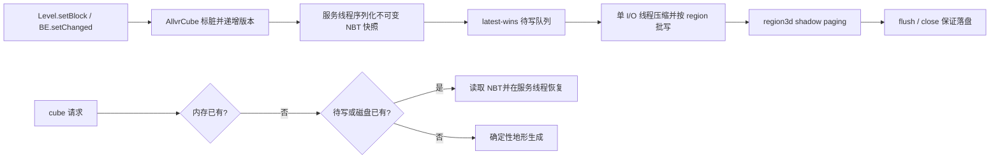

# Allay Dimension 持久化实现计划

> 目标版本：Minecraft 1.21.1 / NeoForge 21.1.x / Java 21  
> 目标维度：`createmanaindustry:allay_dimension`  
> 参考基线：`.refs/CubicChunks`，重点对齐 `RegionCubeStorage`、`AsyncBatchingCubeIO`、`IONbtWriter`、`IONbtReader`、`CubeProviderServer` 的职责边界与保存语义  
> 本文只规划持久化改造，不包含本次代码实现。
>
> **实施状态（2026-09-07）**：P0–P6 已全部落地（`dimension/storage/` 包 + `AllvrCube`/`AllvrCubeMap`/mixins/LOD 接线），28 项纯 JVM 单测全绿（region 映射负坐标、region 文件含断 header/双坏 header 故障注入、worker latest-wins/read-your-writes/flush 耐久、region 存储跨 region 路由与 CRC 损坏检测）；§10.2 GameTest 与 §10.3 手工冒烟矩阵待运行期执行。未移植 `.refs/CubicChunks` 代码（语义对齐、实现原创），无 LICENSE/NOTICE 变更；未引入旧 regionlib 依赖。实现摘要见 `docs/allay-dimension-dev.md` §5.4。

## 1. 结论

当前 ALLVR 的方块数据、方块实体和编辑标记都只存在于 `AllvrCubeMap` 内存中。cube 离开所有玩家的 forget 范围后会被直接移除，重启或远距卸载都会丢失玩家改动；方块实体调用 `setChanged()` 时还只会把空的 vanilla 列 chunk 标脏，无法标记 ALLVR cube。因此，单纯在关服时遍历 `cubes` 写 NBT 并不能形成可靠持久化。

推荐实现一个只服务于 allay dimension 的存储子系统，采用以下架构：

1. `AllvrCube` 负责脏版本、加载/卸载生命周期和可序列化状态。
2. `AllvrCubeSerializer` 在服务线程把可变 cube 快照为命名化 NBT；反序列化也在服务线程完成。
3. `AllvrCubeIoWorker` 持有“同坐标最新值覆盖旧值”的待写队列，后台完成压缩和批量磁盘 I/O；读取先查待写队列，保证 read-your-writes。
4. `AllvrRegionCubeStorage` 将压缩 NBT 存入维度目录下的 `region3d/`，使用 3D region 坐标和 shadow paging，保证进程异常终止时旧记录或新记录至少有一份可读。
5. `AllvrCubeMap` 的加载顺序改为“内存 → 待写队列/磁盘 → 不存在才生成”；卸载顺序改为“快照并入队 → 注销生命周期 → 移除内存”。
6. `ServerLevel.save(..., flush, skipSave)` 和 `ServerLevel.close()` 驱动保存、flush 和 close，语义与 vanilla `/save-all`、自动保存、关服对齐。
7. LOD 构建能够从未加载但已持久化的 cube 读取只读 overlay，保证重启后的远景也能看到玩家改动。



## 2. 当前实现审计

### 2.1 已经具备的基础

- `AllvrCubePos` 使用每轴 21 bit 的 cube key，能覆盖 ±3000 万方块坐标，适合作为内存、待写队列和磁盘索引的统一身份。
- `AllvrCube` 已用 8 个 `LevelChunkSection` 表示 32³ cube，并以 15 bit cube 内 cell index 保存方块实体和光源，避开 `BlockPos.asLong()` 的 12 bit Y 限制。
- `AllvrCubeMap#setBlock` 已是权威写入口；它能识别玩家编辑、维护方块实体、光源以及 LOD 失效。
- `AllvrCubeMap#unloadFarCubes` 已有明确的卸载时机，可直接改造成 save-before-unload。
- `ServerLevel` mixin 已把每个 allay level 的 map 生命周期挂在 level 实例上，不需要全局静态世界表。

### 2.2 必须补齐的缺口

| 缺口 | 当前表现 | 必须采取的措施 |
|---|---|---|
| 无磁盘存储 | 重启全部按种子重生成 | 增加 `region3d` 存储和 cube NBT serializer |
| 卸载不保存 | 离开 forget 范围后玩家改动丢失 | 卸载前对 dirty cube 快照并入队，失败则禁止卸载 |
| BE 脏标记走错对象 | `BlockEntity#setChanged` 最终只标记 vanilla 空列 | 拦截 `Level#blockEntityChanged`，改为标记对应 ALLVR cube |
| 加载只会生成 | 已有存档仍可能被生成结果覆盖 | 严格执行 load-before-generate；损坏记录不得静默重生成 |
| `editedCubes` 只有会话语义 | 重启后 LOD 不知道哪些 cube 有玩家编辑 | 从 region header 枚举持久化坐标，作为跨会话 edited index |
| LOD 只读已加载 cube | 重启后远景忽略未加载编辑 | 为 LOD 增加持久化只读 overlay 获取路径 |
| 无 save/flush/close 接线 | `/save-all flush` 和关服不涉及 ALLVR | 接入 `ServerLevel.save` 和 `close`，并保持 `skipSave` 语义 |
| 无并发版本保护 | 异步写旧快照可能错误清除新修改 | cube 使用 mutation/queued version，而不是单一 boolean |
| 卸载未结束 BE 生命周期 | BE/ticker 只靠 map GC | 明确 `onLoad`/`onUnload`，注销 ticker 并 `setRemoved()` |

另有一个现存问题应在本批顺手修正：`unloadFarCubes` 移除 `cubes` 和 `beCubes`，却不清理或重新定义 `editedCubes`。持久化后该集合应改名并拆成“磁盘/待写中存在记录”和“当前已加载且被编辑”两个明确概念，不能继续作为含糊的会话集合。

## 3. 与 CubicChunks 的对齐方式

### 3.1 直接对齐的语义

| CubicChunks 参考 | 本项目对应设计 |
|---|---|
| `RegionCubeStorage` 的 `region2d/` + `region3d/` 分离 | vanilla 继续拥有标准 `region/` 列数据；ALLVR 只新增 `region3d/`，不复制列数据 |
| `EntryLocation3D(x,y,z)` | `AllvrCubePos(x,y,z)`，负坐标必须使用 `floorDiv/floorMod` 求 region/local 坐标 |
| `IONbtWriter` / `IONbtReader` 独立于磁盘层 | `AllvrCubeSerializer` 只处理 cube ↔ NBT，region 层只处理字节 |
| 世界线程先生成 NBT，I/O 线程再压缩写盘 | 所有 BlockState/BE 访问均留在服务线程；后台线程只接触不可变 `CompoundTag`/byte[] |
| `pendingCubes` 同位置覆盖 | `ConcurrentHashMap<Long, PendingWrite>` latest-wins |
| 读取先查 pending，再查 storage | 卸载后立即重载也能读到尚未落盘的最新快照 |
| snapshot 成功后才 `markSaved` | cube 记录 queued version；写失败时 pending 不移除并继续重试 |
| `writeBatch` 后使用 `remove(key,value)` | 只移除确实写入的那个版本，不能误删写入期间产生的新快照 |
| `flush` 排空队列并强制落盘 | `/save-all flush`、正常关服都阻塞等待 ALLVR I/O 完成 |
| `close` 先排空再关闭 region handles | level close 幂等关闭 worker、region cache 和 LOD worker |
| `CubeProviderServer#tryUnloadCube` 先保存再卸载 | `AllvrCubeMap#unloadFarCubes` 同样执行 save-before-unload |

### 3.2 不直接照搬的部分

- `.refs/CubicChunks` 面向 Minecraft 1.12.2，旧 `regionlib:0.78.0-SNAPSHOT`、`NBTTagCompound`、方块 ID/nibble 数组和 Forge capability API 都不能直接用于 1.21.1。
- 参考实现的 cube 是 16³，本项目 cube 是 32³、包含 8 个现代 `LevelChunkSection`，磁盘 NBT 必须保存 8 份 palette。
- 本项目不接管 vanilla entity manager、POI 和列 tick 容器，因此 V1 不把实体或计划刻重复写入 cube NBT，否则会出现双重恢复。
- 网络包里的 `LevelChunkSection#write` 使用运行时数值 registry ID，只适合同一次连接，不能复用为持久化格式。磁盘必须使用 `PalettedContainer` 的 NBT codec，以资源名表示方块和群系。
- 不直接增加旧 regionlib SNAPSHOT 依赖。实现项目内最小 3D region 文件和 shadow paging，保留格式控制权并减少过时依赖风险；若实际编码时决定移植参考代码，必须保留其 MIT 许可头和 NOTICE 归属。

## 4. V1 持久化范围

### 4.1 纳入权威存档

- 32³ cube 坐标。
- 8 个 section 的 `block_states` palette。
- 8 个 section 的 `biomes` palette；当前虽固定为 plains，仍保存以便未来扩展。
- cube 内所有方块实体的完整 NBT，包括 Data Components 和 NeoForge attachments。
- `DataVersion`、ALLVR `FormatVersion`、`GeneratorVersion`、保存时间及完整性信息。
- “该 cube 有持久化覆盖”的索引；region 中记录存在即表示该 cube 覆盖确定性生成结果。

### 4.2 不作为权威数据保存

| 数据 | V1 处理方式 | 原因 |
|---|---|---|
| `emitters` | 方块/BE 恢复后重新扫描生成 | 它是 BlockState 的派生索引，避免缓存版本不一致 |
| LOD mesh、near mesh | 按持久化 overlay 重新构建 | GPU/材质/算法版本变化频繁，不能污染权威存档 |
| 玩家订阅、客户端已发送集合 | 不保存 | 纯连接期状态 |
| LOD request/cache/generation counter | 不保存 | 纯运行期派生状态 |
| block/fluid scheduled ticks | 继续由 vanilla 列 `LevelTicks`/chunk NBT 保存 | 当前链路已经按 XZ 列工作；重复写入会重复触发 |
| 非玩家实体 | 继续由 vanilla `EntityStorage` 保存 | 当前 ALLVR 没有 cube entity ownership；本批不能双写 |
| POI、结构、heightmap | 继续沿用现状或不保存 | 当前 cube 数据层没有这些权威对象 |

实体在 `SectionPos` 可表达范围外（约 ±840 万方块 Y）的索引/持久化仍是现有架构限制。若目标提升为“±3000 万 Y 的实体也完整持久化”，需要另立任务接管 entity section manager，仿照 CubicChunks 把实体 ownership 移入 cube；这不是本计划的隐含副作用。

## 5. 存档目录和 3D region 格式

### 5.1 目录

通过 `DimensionType.getStorageFolder(level.dimension(), level.getServer().getWorldPath(LevelResource.ROOT))` 获取维度目录，不硬编码单机或服务端路径：

```text
<world>/
└─ dimensions/createmanaindustry/allay_dimension/
   ├─ region/                 # vanilla 空列及其计划刻，保持原样
   └─ region3d/               # ALLVR 新增
      ├─ r.<rx>.<ry>.<rz>.3dr
      └─ corrupt/             # 管理员明确执行修复/隔离时使用
```

不创建 `region2d/`：vanilla 已经负责列数据。也不在 `data/` 下用 `SavedData` 保存全量 cube，因为单文件会导致每次保存重写全部数据，无法按空间局部更新。

### 5.2 region 与 slot 映射

- 一个 region 覆盖 `16 × 16 × 16 = 4096` 个 32³ cube，即每轴 512 方块。
- `rx = floorDiv(cubeX, 16)`，`lx = floorMod(cubeX, 16)`；Y/Z 同理。
- `slot = (ly << 8) | (lz << 4) | lx`，延续项目的 Y-major 约定。
- 必须针对 `-1/-16/-17` 等边界写单元测试，禁止使用带符号右移加掩码来猜负数 local 坐标。

### 5.3 文件布局与崩溃安全

实现 `AllvrRegion3DFile`，固定 4096 B sector，并使用双 header shadow paging：

1. Header A/B 各保存 magic、格式版本、region 坐标、递增 generation、4096 个 slot 的 `{sectorOffset, sectorCount, compressedLength, CRC32C}` 和 header checksum。
2. 打开文件时验证两个 header，选择 generation 最大且 checksum 正确的一份；其中一份损坏时使用另一份。
3. 批写时先为所有新 payload 分配新 sector，写入压缩数据并 `force(false)`。
4. 在非活动 header 副本上应用本批 slot 更新，写完整 header、checksum 后 `force(true)`。
5. 新 header 成功后才允许回收旧 slot sector。进程在任一步骤中断时，旧 header 仍指向旧的完整数据，或新 header 已完整指向新数据。
6. region 内多 cube 一次提交，避免每个 cube 都执行一次 `force()`；不同 region 不承诺世界级事务原子性，这与 vanilla/CubicChunks 的保存模型一致。
7. region handle 使用 access-order LRU，上限固定为 64，只由单 I/O 线程访问；close 时逐个关闭。

首版不做在线压缩整理。shadow paging 回收的 sector 可立即复用；若长期运行后碎片率成为问题，再增加离线 compact 工具，而不是把 compaction 放进游戏 tick。

## 6. Cube NBT schema

V1 根结构固定如下。字段名尽量与 1.21.1 `ChunkSerializer` 对齐，ALLVR 特有字段使用清晰前缀或独立 schema 字段：

```snbt
{
  DataVersion: <minecraft data version>,
  AllvrFormatVersion: 1,
  GeneratorVersion: 1,
  xPos: <cube x>,
  yPos: <cube y>,
  zPos: <cube z>,
  LastUpdate: <game time>,
  sections: [
    {
      Index: 0b,
      block_states: {palette: [...], data: [...]},
      biomes: {palette: [...], data: [...]}
    }
  ],
  block_entities: [
    {id: "namespace:type", x: ..., y: ..., z: ..., ...}
  ]
}
```

实现规则：

- `Index` 取 0..7，不保存为 vanilla 的 byte section Y；绝对 section Y 在 ±3000 万范围内远超 byte。
- section 顺序不是可信输入。读取时按 `Index` 放入数组，检查重复、缺失和越界；缺失项按全 air + plains 处理，重复或越界视为损坏。
- `block_states` 使用与 1.21.1 `ChunkSerializer` 等价的 `PalettedContainer.codecRW(Block.BLOCK_STATE_REGISTRY, BlockState.CODEC, SECTION_STATES, AIR)`。
- `biomes` codec 使用 level 的 biome registry 和 `SECTION_BIOMES` strategy，不能写运行时 holder ID。
- 方块实体使用 `saveWithFullMetadata(registryAccess)`；恢复使用 `BlockEntity.loadStatic(pos, state, tag, registryAccess)`，随后 `setLevel`、`clearRemoved`、注册 ticker。
- 读取 BE 前验证绝对坐标属于目标 cube、目标 BlockState 确实支持该 BE type；不合法条目记录错误并跳过，不能把它放进其他 cube。
- `DataVersion` 保留给未来迁移；不要直接对整个自定义根调用 `DataFixTypes.CHUNK`，因为 32³ schema 不是 vanilla chunk schema。增加 `AllvrCubeDataFixes`，按 `AllvrFormatVersion` 做显式迁移。V1 只接受版本 1，未知的更高版本 fail closed。
- 格式损坏、坐标不匹配或 codec 失败时不得回退地形生成并覆盖原记录。该 cube 保持未加载，服务端按坐标限频记录 ERROR；管理员修复/删除记录后才允许重生成。

完整 cube snapshot 优先于“只存玩家修改的 sparse delta”。原因是 generator 算法升级后，delta 会被应用到不同的底图，导致已有建筑周围地形漂移；完整 snapshot 能冻结被编辑 cube 的真实状态。代价是首次编辑后该 32³ cube 会占用一份完整 palette NBT，这是可接受且更可靠的取舍。

## 7. 类与文件改造清单

### 7.1 新增 `dimension/storage` 包

新增以下类：

| 类 | 职责 |
|---|---|
| `AllvrCubeSerializer` | 服务线程上的 cube ↔ NBT；坐标、schema、palette、BE 校验；生成 `AllvrCubeSnapshot` |
| `AllvrCubeSnapshot` | 不可变 `{cubeKey, mutationVersion, CompoundTag}`，禁止后台线程访问 live cube |
| `AllvrCubeStorage` | 原始存储接口：`has/read/writeBatch/forEachCube/flush/close` |
| `AllvrRegionCubeStorage` | cube 坐标到 region/slot 的路由、region handle LRU、批次按 region 分组 |
| `AllvrRegion3DFile` | 双 header、sector 分配、CRC、shadow-paging commit 与恢复 |
| `AllvrCubeIoWorker` | 单线程 I/O executor、pending latest-wins、读取优先 pending、重试、flush/close |
| `AllvrCubeDataFixes` | 自定义 `AllvrFormatVersion` 迁移入口 |
| `AllvrPersistedOverlay` | LOD 专用不可变方块/光源视图，不实例化 BE、不进入活动 cube map |

存储接口固定为以下最小职责面（实现时可以补充诊断返回值，不扩大世界对象访问范围）：

```java
interface AllvrCubeStorage extends AutoCloseable {
    boolean has(AllvrCubePos pos) throws IOException;
    Optional<CompoundTag> read(AllvrCubePos pos) throws IOException;
    void writeBatch(Map<AllvrCubePos, CompoundTag> cubes) throws IOException;
    void forEachCube(Consumer<AllvrCubePos> consumer) throws IOException;
    void flush() throws IOException;
}
```

`AllvrCubeIoWorker` 对外提供 future 或明确的 blocking 方法；禁止调用方直接持有 region 文件：

```java
CompletableFuture<Optional<CompoundTag>> load(AllvrCubePos pos);
void enqueue(AllvrCubeSnapshot snapshot);
CompletableFuture<Void> flush();
Set<Long> persistedKeysSnapshot();
void close();
```

### 7.2 修改 `AllvrCube`

新增状态：

- `long mutationVersion`：每次权威变更递增。
- `long queuedVersion`：最近成功生成并放入 pending 的快照版本。
- `boolean persistedOverride`：来自磁盘或已产生待写记录。
- `boolean loaded`：避免重复 onLoad/onUnload。

新增/调整方法：

- `markDirty()`、`needsSnapshot()`、`markQueued(version)`，用版本比较防止旧快照清除新变更。
- `onLoad(Level)`：为恢复的 BE 设置 level、clearRemoved、重绑 ticker。
- `onUnload()`：停止 ticker、对所有 BE `setRemoved()`，只做生命周期清理，不改变序列化内容。
- 提供 loader 专用的 section/BE 安装方法，避免反序列化通过普通 `setBlockState` 触发脏标记、邻居更新和网络包。
- 提供 `rebuildDerivedState(Level)`：扫描 32³ BlockState 重建 emitters，并检查/注册 BE ticker。
- generator 完成后的 cube 初始为 clean、`persistedOverride=false`；磁盘恢复后的 cube 初始为 clean、`persistedOverride=true`。

### 7.3 修改 `AllvrCubeMap`

构造阶段：

- 从维度路径创建 storage/worker。
- 只扫描 region header 枚举持久化 cube key，不解压 payload；集合即跨会话 persisted/edited index。
- 初始化失败应使 allay dimension 持久化 fail closed，并输出明确错误，不能默默退化为“继续运行但丢存档”。

加载阶段：

1. 命中 `cubes` 直接返回。
2. 若 key 在 pending/persisted index 中，读取 NBT 并恢复。
3. 只有确认存储中不存在该 key 时才调用 `AllvrIslandFieldGenerator`。
4. 加载后的 cube 加入 `cubes`，按 BE 情况加入 `beCubes`，并执行 `onLoad`。

已有持久化记录的 `getOrGenerate` 仍允许阻塞等待一次 I/O；未编辑 cube 通过 header index 可直接判定不存在。玩家当前 Cube 保留同步生成和直接交互语义，周边 shell 交给有界的单线程 terrain worker，完成后只在服务线程安装；直接交互遇到 pending 任务时保留 blocking fallback。

写入阶段：

- `setBlock` 成功后同时调用 `cube.markDirty()`，并把 key 加入 persisted/edited index。
- `BlockEntity#setChanged` 通过 `Level#blockEntityChanged` 路由后调用 `map.markBlockEntityDirty(pos)`；只允许标记已经加载且确有 BE 的 cube。
- BE ticker 若正确调用 `setChanged()`，即可进入同一保存路径；不调用 `setChanged()` 的第三方 BE 与 vanilla 一样不保证持久化。
- 不在每次方块变化时立刻序列化。变化只把 key 放进 dirty snapshot 维护队列；普通 tick 按 §11 的预算/冷却形成快照，远距卸载与 flush/关服则立即形成快照，避免 `/fill` 产生同步 NBT 风暴。

卸载阶段按以下顺序执行：

1. 确认 cube 超出所有玩家范围，且没有活动 load/save 安装操作。
2. `needsSnapshot()` 时在服务线程生成 snapshot 并 `enqueue`。
3. 序列化失败时保留 cube 在内存中并限频报错，绝不丢弃。
4. `level.noSave` 生效时，dirty cube 暂不卸载；clean 且已有持久化副本的 cube 可以卸载。
5. 调用 `cube.onUnload()`，移除 `cubes`/`beCubes`；persisted index 保留该 key。
6. LOD live overlay 改为读取持久化 overlay，不能回退成生成态。

保存接口：

- `saveAll(false)`：把尚未 queued 的 loaded dirty cube 加入维护队列后返回，语义与 vanilla 非阻塞自动保存一致。
- `saveAll(true)`：忽略普通 tick 预算/冷却，在服务线程为剩余 dirty cube 全部形成快照，随后等待 worker 排空并 `force`。
- `close()`：幂等；最后一次遵守 noSave 语义的 save/flush，关闭 worker，再关闭 region handles。
- 增加诊断计数：loaded、dirty、pending writes、open regions、last I/O error、bytes written、save/flush duration。

### 7.4 修改 `AllvrLevelMixin`

在 `Level#blockEntityChanged(BlockPos)` HEAD 增加 allay dimension 分支：

- `map.markBlockEntityDirty(pos)`。
- 成功路由后 cancel vanilla 分支，避免把空列 chunk 标脏。
- 非 allay dimension 保持逐字节原逻辑。

这是实现 BE 内容持久化的硬要求，不能仅依赖 `setBlock`。

### 7.5 修改 `AllvrServerLevelMixin` / duck interface

- duck interface 增加不触发懒加载的 `allvr$peekCubeMap()`，保存一个从未访问过的 allay level 时不能仅为保存而创建整个存储/LOD 子系统。
- 在 `ServerLevel#save(progress, flush, skipSave)` 接入：
  - HEAD 且 `!skipSave`：对已存在 map 调用 `saveAll(false)`，保证 `LevelEvent.Save` 发生前 dirty key 已进入 ALLVR 保存调度。
  - TAIL 且 `!skipSave && flush`：调用 `saveAll(true)`；这一步必须补齐所有 snapshot 并等待 durable commit，不能只 flush 已存在的 pending。
- 在 `ServerLevel#close()` HEAD 对已存在 map 执行幂等 close，同时关闭 `AllvrLodMap` 的线程池；异常要聚合/记录，不能阻止其余 vanilla level resource 关闭。
- 不只依赖 `LevelEvent.Save`，因为事件本身没有 `flush` 参数，无法准确实现 `/save-all flush`。

### 7.6 修改 `AllvrLodMap` / `AllvrLodSnapshot`

当前 `AllvrLodSnapshot.capture` 对 edited-but-unloaded cube 直接 `continue`，持久化后必须移除该 R14 语义：

1. persisted index 用于找出节点及 padding 范围内存在覆盖记录的 cube。
2. 已加载 cube 在服务线程捕获 live overlay。
3. 未加载 cube 通过 `AllvrCubeIoWorker` 读取最新 pending/磁盘 NBT，解码成 `AllvrPersistedOverlay`；不创建 BE、不加入 `cubes`、不参与 tick。
4. 等 overlay 齐备后才把不可变 job 交给 LOD build pool。
5. 若等待期间发生编辑，`AllvrLodMap` 现有 generation 机制判定结果 stale 并重试。
6. I/O 失败时发送 forget 并保留重试能力，不能缓存“生成态远景”覆盖真实编辑。
7. `AllvrLodMap#close()` shutdown pool，拒绝新 job，等待或取消未完成任务并清空结果队列。

不要为了 LOD 直接把所有持久化 cube 常驻内存；那会取消现有卸载机制的意义。

### 7.7 文档与构建文件

- `docs/allay-dimension-dev.md`：实现完成后将“阶段 6 前无存档/R14”更新为实际格式、限制和测试结果。
- `build.gradle`：仅增加测试依赖/测试任务配置；本方案不增加旧 regionlib 运行时依赖。
- `LICENSE`/`NOTICE`：若实际移植 `.refs/CubicChunks` 或 `ShadowPagingRegion` 的代码，保留 MIT 版权声明并追加归属。

## 8. 并发模型与不变量

必须在代码注释和测试中固定以下不变量：

1. live `AllvrCube`、`LevelChunkSection` 和 `BlockEntity` 只在服务线程读写。
2. I/O 线程只处理不可变 snapshot、压缩 byte[] 和 region 文件。
3. 每个 cube key 的 pending 条目永远是最新 queued version。
4. 批写成功后使用 `(key, exactPendingValue)` 条件移除；写入过程中出现的新版本不能被旧批次删除。
5. 磁盘读取前先检查 pending；因此 save 后立即卸载/重载不会读回旧盘数据。
6. cube 从内存移除之前，若 dirty，必须已经有成功构建的 pending snapshot。
7. 存储记录存在与“应覆盖 generator”同义；空 cube 也必须保存，不能把全 air 误判为“无记录”。
8. corrupt/unknown-version 记录不得触发 generator fallback。
9. `flush()` 返回时 pending 为空、所有 region commit 已 force；`close()` 返回后不能再提交读写。
10. 任何 off-thread load 都只能产出 NBT/immutable overlay，最终 live cube 安装必须回到服务线程。

推荐给 worker 设计显式状态：`OPEN → CLOSING → CLOSED`。第一次 I/O 异常保留 pending 并记录；后续保存继续重试。flush/close 在重试上限后抛出包含 cube/region 坐标的聚合异常，不能打印后假装成功。

## 9. 分阶段实施顺序

### P0：先锁定测试与格式常量

- 为 cube→region 映射、负坐标、slot 编号、版本校验建立纯 Java 单元测试。
- 定义 magic、format version、sector size、region diameter、压缩算法 ID。
- 增加测试用临时目录工厂，所有 destructive 测试只操作该目录。

完成标准：边界坐标（包括 ±3000 万附近）映射可逆，负数 region 边界全通过。

### P1：serializer round-trip

- 实现 8 section palette 与 biome palette 的 NBT 编解码。
- 实现 BE 完整 NBT 保存/恢复、坐标/type 校验和 derived emitter 重建。
- 给 `AllvrCube` 增加 loader API 与生命周期 API。

完成标准：复杂 palette、全 air、全单一方块、跨 8 section、容器 BE 物品与自定义组件 round-trip 一致。

### P2：region3d + shadow paging

- 实现双 header、sector allocator、CRC、batch commit、header 恢复、LRU close。
- 注入故障点模拟“写 payload 后崩溃”“写半个 header 后崩溃”“commit 后崩溃”。

完成标准：每个故障点重开后只能读到完整旧值或完整新值，不出现半条 NBT；损坏能被明确检测。

### P3：异步 worker

- 实现 pending latest-wins、读 pending 优先、按 region 分批、条件移除、重试、flush/close。
- snapshot 在调用线程创建，压缩/磁盘写在 worker。

完成标准：同坐标连续提交 A/B/C 后最终只读 C；写 C 期间再次提交 D 不会被 C 的完成回调删除；flush 后重开仍读 D。

### P4：接入 `AllvrCubeMap`

- load-before-generate。
- `setBlock` 和 BE dirty 路由。
- save-before-unload、noSave、失败 pinning。
- persisted index 与诊断计数。

完成标准：远距卸载再返回、自动保存后重启、`/save-all flush` 后强制终止三条路径均保留 block/BE 改动。

### P5：level 生命周期接线

- `ServerLevel.save` 的 queue/flush。
- `ServerLevel.close` 的幂等 close。
- LOD pool 同步关闭。

完成标准：集成服务端关服无线程泄漏、无未关闭文件、无 pending；从未进入 allay dimension 时不创建 `region3d`。

### P6：持久化 LOD overlay

- persisted cube enumeration。
- 未加载 snapshot 的只读 overlay 解码。
- 与现有 LOD generation/stale 机制结合。

完成标准：在远离建筑后保存并重启，不先加载建筑附近 full-res cube，远景 LOD 仍显示编辑；靠近后 full-res 与 LOD 一致。

### P7：性能和恢复收尾

- 记录 snapshot、压缩、region commit、flush 耗时和队列峰值。
- 针对磁盘慢、I/O 异常、损坏记录提供清晰日志。
- 更新总开发文档与风险表。

完成标准：自动保存不出现不可接受的主线程峰值；I/O worker 无无界队列增长；恢复策略有可执行的管理员说明。

## 10. 测试矩阵

### 10.1 单元测试

- `AllvrCubePos`/region/local/slot 在正负边界可逆。
- section index 0..7 完整 round-trip。
- 随机 palette、单值 palette、全 air cube。
- cube 坐标 `y=0`、`±1`、`±65536`、接近软件边界的高低 Y。
- BE：箱子物品、Create/CMI 机器进度、Data Components、NeoForge attachments。
- 重建 emitters 与原始 BlockState 发光值一致。
- 根坐标不匹配、重复 section index、未知格式版本、截断 payload、CRC 错误。
- latest-wins、read-your-writes、flush/close 幂等、close 后拒绝提交。
- shadow paging 的每个故障注入点。

### 10.2 GameTest / 集成测试

- `Level#setBlock` 改动能标 dirty；相同状态写入不产生新版本。
- 只改变 BE 内容、不改变方块状态时也能标 dirty。
- cube unload 时先进入 pending，再从活动 map 移除。
- pending 尚未落盘时重新加载，读到 pending 新值。
- corrupt cube 不生成替代地形。
- `skipSave=true` 不创建新快照；dirty cube 在 noSave 期间不被普通远距卸载丢弃。
- 非 allay dimension 的 save、BE dirty、chunk 行为完全不变。

### 10.3 手工冒烟

在以下 Y 各放置一种显眼方块和带物品/进度的 BE：`0`、`2048`、`1_000_000`、`-1_000_000`、接近 `±29_999_984` 的合法位置，然后执行：

1. `/save-all flush` → 正常关服 → 重启。
2. 传送超过 forget 半径，等待一次卸载扫描，再返回。
3. 自动保存后等待诊断计数显示 dirty/pending 均为 0，再强制终止进程并启动。
4. 保存期间连续修改同一 cube，确认最终状态不是旧快照。
5. 重启后先在远处观察 LOD，再靠近观察 full-res。
6. 在 allay/overworld/nether 间往返，确认其他维度存档无变化。

验收时同时检查日志和文件句柄：不允许出现静默 fallback、`RejectedExecutionException`、关服线程残留或 Windows 下 region 文件无法再次打开。

## 11. 性能预算

- 服务线程绝不执行压缩和 `FileChannel.force`。
- 服务线程只承担 NBT snapshot。P4 起增加 dirty snapshot 维护队列：普通 tick 最多处理 8 个 cube 或 1 ms（先到者停止），同一 cube 两次后台快照至少间隔 200 tick；卸载目标、`save-all flush` 和关服不受该预算/冷却限制，必须完整处理。自动保存把尚未排队的 dirty key 全部加入该维护队列，不在一次 tick 内强制完成所有 snapshot。
- region batch 以一次 worker drain 中的 pending 快照为单位，并按 region 分组；同一 region 一次 header commit。
- header index 启动扫描只读固定头部、不解压 NBT。若大型存档实测启动扫描超过预算，再把它改为后台扫描并在未完成区域使用按 region lazy discovery；V1 先保持简单且确定。
- 不保存纯生成且从未编辑的 cube，因此磁盘增长与玩家改动范围相关，而不是与探索范围相关。
- 给 pending 数量和待写字节设置软告警阈值，不在压力下丢数据；达到阈值时降低新 cube 生成/流送预算，而不是删除 pending。

## 12. 风险、恢复与回滚

| 风险 | 对策 |
|---|---|
| 自定义 region 格式缺少第三方工具 | 提供 `forEachCube`/dump 校验入口，schema 使用可读 NBT；后续可做独立导出器 |
| 格式实现本身出错 | 双 header、payload/header checksum、故障注入测试、fail closed |
| 旧快照覆盖新修改 | mutation/queued version + pending latest-wins + 条件移除 |
| BE 保存异常 | 捕获到 cube 坐标和 BE id，禁止卸载该 cube；不能跳过 BE 后假装保存成功 |
| generator 升级造成接缝 | 编辑 cube 保存完整 snapshot，并记录 `GeneratorVersion`；未编辑区域仍可升级生成 |
| LOD 读取未加载覆盖导致 I/O 放大 | 只读取 persisted index 命中的少量 cube，结果进入现有 LOD cache；不加载 BE |
| `/save-off` 语义被破坏 | 所有 level save 接线遵守 `skipSave`；noSave 时 dirty cube 不做普通卸载写盘 |
| 新格式发布后需迁移 | 只通过 `AllvrCubeDataFixes` 升级；不原地覆盖未知高版本；迁移前备份 region 文件 |

不提供运行时 `allvrPersistenceEnabled` 开关：一旦世界存在 `region3d`，绕过它启动会把已保存区域显示为生成态，并可能产生冲突。开发期若要对照旧行为，只能使用单独的新测试世界。回滚旧 mod 版本前必须备份世界；旧版本无法读取 `region3d`，会显示确定性生成态。

## 13. Definition of Done

只有同时满足以下条件，才能把 `docs/allay-dimension-dev.md` 中的 R14 标记为关闭：

- 方块修改与方块实体内容经过远距卸载、完成的自动保存、`/save-all flush` 和正常关服后可恢复；异常终止最多丢失尚未完成后台快照的最近修改，但绝不损坏上一份已提交记录。
- `BlockEntity#setChanged()` 能标记正确 cube，而不是依赖空列 dirty。
- 存储记录总是优先于 generator；损坏记录不会被静默重生成覆盖。
- pending 队列满足 latest-wins 和 read-your-writes，flush/close 的 durable 语义有自动测试。
- 负坐标和 ±3000 万范围附近的 region 映射通过测试。
- 重启后的未加载编辑能够进入 LOD overlay，远近景一致。
- 非 allay dimension 无行为回归。
- 关服无 pending write、I/O/LOD 线程泄漏和未关闭 region 文件。
- 文档写明 V1 不接管全高度实体、POI 和 orphan scheduled ticks；这些限制不能被“维度已持久化”一句话掩盖。

## 14. 参考代码索引

- 当前 cube 数据：`src/main/java/com/iridium126/createmanaindustry/dimension/cube/AllvrCube.java`
- 当前 cube 生命周期：`src/main/java/com/iridium126/createmanaindustry/dimension/cube/AllvrCubeMap.java`
- 当前 level 路由：`src/main/java/com/iridium126/createmanaindustry/mixin/allvr/AllvrLevelMixin.java`
- 当前 level 挂载：`src/main/java/com/iridium126/createmanaindustry/mixin/allvr/AllvrServerLevelMixin.java`
- 当前 LOD overlay：`src/main/java/com/iridium126/createmanaindustry/dimension/lod/AllvrLodSnapshot.java`
- CubicChunks region facade：`.refs/CubicChunks/src/main/java/io/github/opencubicchunks/cubicchunks/core/server/chunkio/RegionCubeStorage.java`
- CubicChunks async/pending：`.refs/CubicChunks/src/main/java/io/github/opencubicchunks/cubicchunks/core/server/chunkio/AsyncBatchingCubeIO.java`
- CubicChunks NBT writer/reader：`.refs/CubicChunks/src/main/java/io/github/opencubicchunks/cubicchunks/core/server/chunkio/IONbtWriter.java`、`IONbtReader.java`
- CubicChunks unload/save：`.refs/CubicChunks/src/main/java/io/github/opencubicchunks/cubicchunks/core/server/CubeProviderServer.java`
- CubicChunks shadow paging：`.refs/CubicChunks/src/main/java/io/github/opencubicchunks/cubicchunks/core/server/chunkio/region/ShadowPagingRegion.java`
- 1.21.1 palette NBT 范式：`.refs/neoforge-21.1.227/net/minecraft/world/level/chunk/storage/ChunkSerializer.java`
- 1.21.1 save/flush 生命周期：`.refs/neoforge-21.1.227/net/minecraft/server/level/ServerLevel.java`、`MinecraftServer.java`
